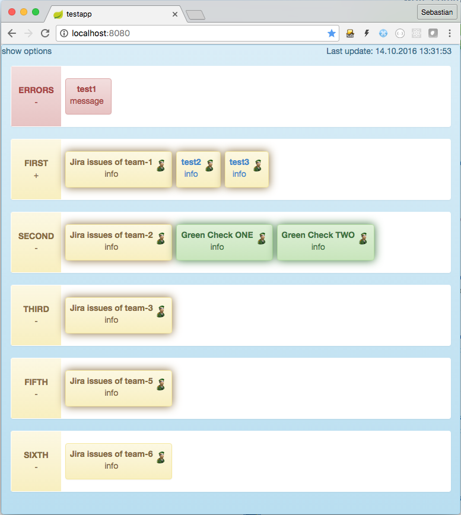

Current build status: [](https://travis-ci.org/as-ideas/ideas-dash)

An extendable Dashboard for development teams

How it works?

- Quickstart
Create a Spring-Boot-Application like the one you can find in the dash-example-module

- Terms
-- CheckResults can be grouped in the UI. Thats what Groups are for
-- Teams are used as filters. This way many teams can share (no team specified) checks/results or have checks executed that only concern them and not interfere with other teams

- Supported Checks
-- Jenkins
Jenkins can be queried for build results if you provide JenkinsChecks via a CheckProvider. JenkinsJobListCheckProvider may come in handy for you as it parses the complete list of jenkins jobs for specified patterns and creates JenkinsChecks automatically.
No more manual configuration for these.
-- Jira
Jira can be queried for issues (Bugs, Stories, Whatever). You may like to take a look at JiraQueryBuilder as a starting point for creating JiraChecks.
-- Fabric
FabricCheck
-- DataDog
DataDog can be queried for monitors. Just provide DataDogChecks via a CheckProvider.
-- Art-Tests
Art is supported as well in theory. This was not used in a while and may prove unstable.
-- Statushub
Statushub is supported as well. Markup will be parsed for css-classes (incident)

- Philips Hue overall-state indicator
You can connect philips hue to the dash to indicate the overall state more "physically".
What you have to do:

* Connect the hue-bridge to the same network as the computer running the dash. if you want to connect it directly you need to enable a dhcp-server on the machine.
For windows you could use something like http://www.dhcpserver.de/ (dont forget to add firewall exceptions).
* Find the bridge IP and go to http://bridge.ip/debug/clip.html
* Create new developer by firing a POST request with a payload like this: {"devicetype":"my_hue_app#gaffa"} against /api and holding the key on the bridge at the same time (following http://www.developers.meethue.com/documentation/getting-started) - you will receive a 'username' which you shall enter in the "key" - field of yana-dash.
* If you want to register a new light, POST a request against /api/key/lights with a payload like this: {"deviceid":["34AFBE"]} 
(deviceide being the serial on the bulb)
* Fire a GET request against /api/yourkey/lights and find the light you want to use
* Enter the bridge ip, the key and the light # in the hue configuration in the dash ui

```xml
<dependencies>
    <dependency>
        <groupId>de.axelspringer.ideas.tools</groupId>
        <artifactId>ideas-dash</artifactId>
        <version>1.0-SNAPSHOT</version>
    </dependency>
</dependencies>

<repositories>
    <repository>
        <id>ideas-de.axelspringer.ideas.tools.dash</id>
        <url>https://raw.github.com/as-ideas/ideas-dash/mvn-repo/</url>
        <snapshots>
            <enabled>true</enabled>
            <updatePolicy>always</updatePolicy>
        </snapshots>
    </repository>
</repositories>
```

# Example



* To run the example just run ``ideas-dash/dash-example/src/main/java/de/axelspringer/ideas/tools/dash/example/ExampleDash.java``
* [You can find the example running here](http://asideas.de/ideas-dash-example/)